# Language Modality Transfer for Instant Policy

## Zero-Shot Robot Control via Natural Language Instructions

This document provides a comprehensive technical overview of the language modality transfer implementation for the Instant Policy framework, enabling robots to execute tasks from natural language descriptions instead of point cloud demonstrations.

---

## Table of Contents

1. [Executive Summary](#1-executive-summary)
2. [Background: The Instant Policy Bottleneck](#2-background-the-instant-policy-bottleneck)
3. [Architecture Overview](#3-architecture-overview)
4. [Implementation Details](#4-implementation-details)
5. [Training Pipeline](#5-training-pipeline)
6. [Inference Pipeline](#6-inference-pipeline)
7. [Key Design Decisions](#7-key-design-decisions)
8. [File Reference](#8-file-reference)
9. [Usage Guide](#9-usage-guide)
10. [Results & Evaluation](#10-results--evaluation)

---

## Complete Architecture Diagram

```mermaid
%%{init: {'theme': 'base', 'themeVariables': { 'primaryColor': '#e1f5fe', 'primaryTextColor': '#01579b', 'primaryBorderColor': '#0288d1', 'lineColor': '#0288d1', 'secondaryColor': '#fff3e0', 'tertiaryColor': '#e8f5e9'}}}%%

flowchart TB
    subgraph TITLE[" "]
        direction LR
        T1["<b>LANGUAGE MODALITY TRANSFER FOR INSTANT POLICY</b><br/>Zero-Shot Robot Control via Natural Language"]
    end

    subgraph TRAINING["<b>🎓 TRAINING PHASE</b>"]
        direction TB

        subgraph TEACHER["<b>TEACHER (Frozen)</b>"]
            direction TB
            DEMOS["📦 Point Cloud Demos<br/><i>2 demos × 10 timesteps</i><br/>[2, 10, 16, 1024]"]
            CURR_OBS_T["📷 Current Observation<br/><i>Point cloud + gripper pose</i>"]

            SCENE_ENC_T["<b>Scene Encoder</b><br/><i>PointNet++</i><br/>Point cloud → 16 nodes × 1024D"]
            LOCAL_ENC["<b>Local Encoder σ</b><br/><i>Graph Transformer</i><br/>2 layers"]
            COND_ENC["<b>Conditional Encoder φ</b><br/><i>Graph Transformer</i><br/>Aggregates demo info"]

            DEMO_BOTTLENECK["⭐ <b>DEMO BOTTLENECK</b><br/>[B, 6, 1024]<br/><i>6 gripper nodes × 1024D</i><br/><b>= 6,144 dimensions</b>"]

            DEMOS --> SCENE_ENC_T
            CURR_OBS_T --> SCENE_ENC_T
            SCENE_ENC_T --> LOCAL_ENC
            LOCAL_ENC --> COND_ENC
            COND_ENC --> DEMO_BOTTLENECK
        end

        subgraph STUDENT["<b>STUDENT (Trainable)</b>"]
            direction TB
            LANG_INPUT["💬 Language Input<br/><i>'Press the button.'</i>"]
            CURR_OBS_S["📷 Current Observation<br/><i>Point cloud + gripper pose</i>"]

            SBERT["<b>Sentence-BERT</b><br/><i>all-mpnet-base-v2</i><br/>~110M params (frozen)<br/>Text → [B, 768]"]

            SCENE_ENC_S["<b>Scene Encoder</b><br/>(shared, frozen)"]
            LOCAL_ENC_S["<b>Local Encoder σ</b><br/>(shared, frozen)"]

            subgraph LANG_ENC["<b>Language Encoder θ</b><br/><i>~130M trainable params</i>"]
                direction TB
                LANG_PROJ["<b>Language Projection</b><br/>Linear(768 → 1024)<br/>787K params"]

                subgraph GRAPH["<b>Heterogeneous Graph</b>"]
                    direction LR
                    SCENE_NODES["🔵 Scene<br/>16 nodes"]
                    GRIPPER_NODES["🟢 Gripper<br/>6 nodes"]
                    LANG_NODE["🟡 Language<br/>1 node"]
                end

                GRAPH_TRANS["<b>Graph Transformer</b><br/>4 layers × 16 heads<br/>6 edge types × 3 node types<br/>~129M params"]
            end

            LANG_BOTTLENECK["⭐ <b>LANG BOTTLENECK</b><br/>[B, 6, 1024]<br/><i>6 gripper nodes × 1024D</i>"]

            LANG_INPUT --> SBERT
            CURR_OBS_S --> SCENE_ENC_S
            SCENE_ENC_S --> LOCAL_ENC_S
            SBERT --> LANG_PROJ
            LOCAL_ENC_S --> GRAPH
            LANG_PROJ --> LANG_NODE
            GRAPH --> GRAPH_TRANS
            GRAPH_TRANS --> LANG_BOTTLENECK
        end

        subgraph LOSS["<b>📉 LOSS FUNCTION</b>"]
            direction TB
            INFONCE["<b>InfoNCE Loss</b><br/>temperature = 0.07<br/>weight = 1.0<br/><i>Discriminative: different tasks<br/>→ different bottlenecks</i>"]
            L2["<b>L2 Loss (MSE)</b><br/>weight = 0.1<br/><i>Generative: exact<br/>bottleneck alignment</i>"]
            TOTAL_LOSS["<b>Total Loss</b><br/>L = 1.0×InfoNCE + 0.1×L2"]

            INFONCE --> TOTAL_LOSS
            L2 --> TOTAL_LOSS
        end

        DEMO_BOTTLENECK -.->|"Target"| LOSS
        LANG_BOTTLENECK -.->|"Prediction"| LOSS
    end

    subgraph INFERENCE["<b>🚀 INFERENCE PHASE</b>"]
        direction TB

        LANG_INF["💬 'Press the button.'"]
        OBS_INF["📷 Current Observation"]

        SBERT_INF["<b>Sentence-BERT</b><br/>[768D]"]
        ENCODER_INF["<b>Trained Language Encoder θ</b>"]

        BOTTLENECK_INF["⭐ <b>BOTTLENECK</b><br/>[1, 6, 1024]"]

        subgraph FROZEN_DECODER["<b>FROZEN ACTION DECODER</b>"]
            direction TB
            DUMMY["📦 Dummy Demos<br/><i>All zeros, correct structure</i><br/><i>Maintains graph topology</i>"]
            COND_INF["<b>cond_encoder</b><br/><i>Updates scene features</i>"]
            INJECT["💉 <b>INJECT</b><br/><i>Overwrite gripper nodes</i>"]
            ACTION_ENC["<b>Action Encoder ψ</b><br/><i>Graph Transformer</i>"]
            HEADS["<b>Prediction Heads</b><br/>Translation (3D)<br/>Rotation (3D)<br/>Gripper (1D)"]
            DIFFUSION["<b>Diffusion Denoising</b><br/>4-8 iterations"]

            DUMMY --> COND_INF
            COND_INF --> INJECT
            INJECT --> ACTION_ENC
            ACTION_ENC --> HEADS
            HEADS --> DIFFUSION
        end

        ACTIONS["🤖 <b>Robot Actions</b><br/>[1, 8, 4, 4] SE(3)"]

        LANG_INF --> SBERT_INF
        OBS_INF --> ENCODER_INF
        SBERT_INF --> ENCODER_INF
        ENCODER_INF --> BOTTLENECK_INF
        BOTTLENECK_INF --> INJECT
        DIFFUSION --> ACTIONS
    end

    subgraph DIMENSIONS["<b>📐 TENSOR DIMENSIONS</b>"]
        direction LR
        subgraph DIM_INPUT["Inputs"]
            D1["scene_x: [B, 16, 1024]"]
            D2["gripper_x: [B, 6, 1024]"]
            D3["lang_emb: [B, 768]"]
        end
        subgraph DIM_GRAPH["Graph per sample"]
            D4["Nodes: 23 total<br/>(16 scene + 6 gripper + 1 lang)"]
            D5["Edges: 411 total<br/>(256 + 96 + 36 + 16 + 6 + 1)"]
            D6["Edge attr: 126D<br/>(63D × 2 positional)"]
        end
        subgraph DIM_OUTPUT["Output"]
            D7["bottleneck: [B, 6, 1024]<br/>= 6,144 dimensions"]
        end
    end

    subgraph PARAMS["<b>📊 PARAMETERS & MEMORY</b>"]
        direction LR
        subgraph PARAM_COUNT["Parameter Counts"]
            P1["Language Encoder: ~130M"]
            P2["Sentence-BERT: ~110M (frozen)"]
            P3["Teacher Model: ~150-200M (frozen)"]
        end
        subgraph MEMORY["Memory Usage"]
            M1["Training: ~3-4 GB GPU"]
            M2["Inference: ~1.8 GB GPU"]
        end
    end

    subgraph RESULTS["<b>📈 TRAINING RESULTS (50K steps)</b>"]
        direction LR
        R1["Similarity: 0.0 → <b>0.952</b>"]
        R2["Loss: 4.0 → <b>0.100</b>"]
        R3["L2 Loss: 12.0 → <b>0.188</b>"]
        R4["Contrastive: 2.5 → <b>0.081</b>"]
    end

    subgraph EDGE_TYPES["<b>🔗 EDGE TYPES IN LANGUAGE ENCODER</b>"]
        direction TB
        E1["(scene, rel, scene): 16×16 = 256 edges"]
        E2["(scene, rel, gripper): 16×6 = 96 edges"]
        E3["(gripper, rel, gripper): 6×6 = 36 edges"]
        E4["(language, lang_to_scene): 1×16 = 16 edges"]
        E5["(language, lang_to_gripper): 1×6 = 6 edges"]
        E6["(language, lang_self): 1×1 = 1 edge"]
    end

    %% Styling
    style TITLE fill:#1565c0,stroke:#0d47a1,color:#fff
    style TRAINING fill:#e3f2fd,stroke:#1976d2
    style INFERENCE fill:#fff3e0,stroke:#ff9800
    style TEACHER fill:#e8f5e9,stroke:#4caf50
    style STUDENT fill:#fce4ec,stroke:#e91e63
    style LOSS fill:#fff9c4,stroke:#fbc02d
    style FROZEN_DECODER fill:#f3e5f5,stroke:#9c27b0
    style DEMO_BOTTLENECK fill:#ffeb3b,stroke:#f57f17,color:#000
    style LANG_BOTTLENECK fill:#ffeb3b,stroke:#f57f17,color:#000
    style BOTTLENECK_INF fill:#ffeb3b,stroke:#f57f17,color:#000
    style LANG_ENC fill:#e1bee7,stroke:#7b1fa2
    style DIMENSIONS fill:#e0f7fa,stroke:#00838f
    style PARAMS fill:#fafafa,stroke:#616161
    style RESULTS fill:#c8e6c9,stroke:#2e7d32
    style EDGE_TYPES fill:#ffe0b2,stroke:#ef6c00
```



---

## 1. Executive Summary

### The Problem
Instant Policy requires 1-2 point cloud demonstrations (3D scene + gripper poses) to execute new tasks. This is limiting because:
- Demonstrations must be recorded for each new task
- Real-time task specification is not possible
- Human-robot interaction requires demonstration interfaces

### The Solution
We implement **language modality transfer** that:
- Replaces point cloud demonstrations with natural language instructions
- Reuses the frozen pre-trained action decoder (ψ)
- Requires only a small language-annotated dataset for training
- Enables zero-shot transfer to language-defined tasks

### Key Insight
The Instant Policy architecture has a natural **information bottleneck** where all task-relevant information from demonstrations is compressed into 6 gripper nodes × 1024 dimensions. We learn to approximate this bottleneck from language + current observation, then reuse the frozen action decoder.

```
DEMO PATH:    demos → σ → ϕ → [BOTTLENECK] → ψ → actions
LANGUAGE PATH: obs + lang → θ → [BOTTLENECK] → ψ → actions (frozen)
```

---

## 2. Background: The Instant Policy Bottleneck

### Original Architecture Flow

```
┌─────────────────────────────────────────────────────────────────────────────┐
│                           INSTANT POLICY ARCHITECTURE                        │
├─────────────────────────────────────────────────────────────────────────────┤
│                                                                             │
│  DEMONSTRATIONS              CURRENT OBSERVATION                            │
│  (2 demos × 10 timesteps)    (point cloud + gripper pose)                   │
│         │                              │                                    │
│         ▼                              ▼                                    │
│  ┌─────────────────────────────────────────────────────────┐                │
│  │              SCENE ENCODER (PointNet++)                  │                │
│  │         Extract 16 scene nodes with 1024D features       │                │
│  └─────────────────────────────────────────────────────────┘                │
│         │                              │                                    │
│         ▼                              ▼                                    │
│  ┌─────────────────────────────────────────────────────────┐                │
│  │              LOCAL ENCODER σ (Graph Transformer)         │                │
│  │    Process scene + gripper nodes with spatial edges      │                │
│  └─────────────────────────────────────────────────────────┘                │
│                        │                                                    │
│                        ▼                                                    │
│  ┌─────────────────────────────────────────────────────────┐                │
│  │           CONDITIONAL ENCODER ϕ (Graph Transformer)      │                │
│  │      Aggregate demo information to current gripper       │                │
│  └─────────────────────────────────────────────────────────┘                │
│                        │                                                    │
│                        ▼                                                    │
│  ╔═════════════════════════════════════════════════════════╗                │
│  ║            ★ BOTTLENECK: 6 gripper nodes × 1024D ★       ║                │
│  ║       Contains ALL task-relevant information from demos  ║                │
│  ╚═════════════════════════════════════════════════════════╝                │
│                        │                                                    │
│                        ▼                                                    │
│  ┌─────────────────────────────────────────────────────────┐                │
│  │            ACTION ENCODER ψ (Graph Transformer)          │                │
│  │         Generate future action predictions               │                │
│  └─────────────────────────────────────────────────────────┘                │
│                        │                                                    │
│                        ▼                                                    │
│  ┌─────────────────────────────────────────────────────────┐                │
│  │              PREDICTION HEADS (3 MLPs)                   │                │
│  │         Translation (3D) + Rotation (3D) + Gripper (1D)  │                │
│  └─────────────────────────────────────────────────────────┘                │
│                        │                                                    │
│                        ▼                                                    │
│  ┌─────────────────────────────────────────────────────────┐                │
│  │              DIFFUSION DENOISING (4-8 steps)             │                │
│  │         Iteratively refine noisy actions                 │                │
│  └─────────────────────────────────────────────────────────┘                │
│                                                                             │
└─────────────────────────────────────────────────────────────────────────────┘
```

### The Bottleneck

After the conditional encoder (ϕ), the **current gripper nodes** contain:
- **6 nodes** representing gripper geometry (center, tail, sides, fingers)
- **1024 dimensions per node** encoding task context
- **Total**: 6,144 dimensional task representation

This bottleneck implicitly encodes:
- What object to manipulate
- Where the target location is
- What trajectory to follow
- How to grip the object

**Key Observation**: The action encoder (ψ) only needs this bottleneck to generate correct actions. It doesn't care HOW the bottleneck was computed—from demos or from language.

---

## 3. Architecture Overview

### Language Modality Transfer Design

```
┌─────────────────────────────────────────────────────────────────────────────┐
│                    LANGUAGE MODALITY TRANSFER ARCHITECTURE                   │
├─────────────────────────────────────────────────────────────────────────────┤
│                                                                             │
│  TRAINING PHASE                                                             │
│  ═════════════                                                              │
│                                                                             │
│  ┌────────────────────────┐    ┌────────────────────────────────────────┐   │
│  │    TEACHER (Frozen)    │    │         STUDENT (Trainable)           │   │
│  ├────────────────────────┤    ├────────────────────────────────────────┤   │
│  │                        │    │                                        │   │
│  │  demos + current obs   │    │  current obs + language embedding     │   │
│  │         │              │    │         │              │               │   │
│  │         ▼              │    │         ▼              ▼               │   │
│  │    scene_encoder       │    │    scene_encoder   Sentence-BERT      │   │
│  │         │              │    │    (frozen)        (pre-trained)       │   │
│  │         ▼              │    │         │              │               │   │
│  │    local_encoder σ     │    │    local_encoder      │               │   │
│  │         │              │    │    (frozen)           │               │   │
│  │         ▼              │    │         │              │               │   │
│  │    cond_encoder ϕ      │    │         └──────┬───────┘               │   │
│  │         │              │    │                │                       │   │
│  │         ▼              │    │                ▼                       │   │
│  │    ╔════════════╗      │    │    ┌─────────────────────────┐        │   │
│  │    ║ BOTTLENECK ║      │    │    │  LANGUAGE ENCODER θ     │        │   │
│  │    ║ [6, 1024]  ║◄─────┼────┼───►│  (Graph Transformer)    │        │   │
│  │    ╚════════════╝      │    │    │  4 layers, 16 heads     │        │   │
│  │         ▲              │    │    └───────────┬─────────────┘        │   │
│  │         │              │    │                │                       │   │
│  │    TARGET for          │    │                ▼                       │   │
│  │    contrastive +       │    │         ╔════════════╗                │   │
│  │    L2 loss             │    │         ║ BOTTLENECK ║                │   │
│  │                        │    │         ║ [6, 1024]  ║                │   │
│  └────────────────────────┘    │         ╚════════════╝                │   │
│                                └────────────────────────────────────────┘   │
│                                                                             │
│  LOSS FUNCTION                                                              │
│  ═════════════                                                              │
│  L = 1.0 × InfoNCE(lang_bottleneck, demo_bottleneck) +                      │
│      0.1 × MSE(lang_bottleneck, demo_bottleneck)                            │
│                                                                             │
├─────────────────────────────────────────────────────────────────────────────┤
│                                                                             │
│  INFERENCE PHASE                                                            │
│  ═══════════════                                                            │
│                                                                             │
│  "Press the button" ──► Sentence-BERT ──► [768D embedding]                  │
│                                                   │                         │
│  current observation ──► scene_encoder ──► local_encoder                    │
│                                                   │                         │
│                          ┌────────────────────────┴───────────────────┐     │
│                          │         LANGUAGE ENCODER θ                 │     │
│                          │    (scene_x, gripper_x, lang_emb) → θ     │     │
│                          └────────────────────────┬───────────────────┘     │
│                                                   │                         │
│                                                   ▼                         │
│                                          ╔════════════╗                     │
│                                          ║ BOTTLENECK ║                     │
│                                          ║ [6, 1024]  ║                     │
│                                          ╚═════╤══════╝                     │
│                                                │                            │
│                     ┌──────────────────────────┴──────────────────────────┐ │
│                     │              FROZEN ACTION DECODER                  │ │
│                     │  cond_encoder → [inject bottleneck] → action_encoder│ │
│                     │              → heads → diffusion                    │ │
│                     └──────────────────────────┬──────────────────────────┘ │
│                                                │                            │
│                                                ▼                            │
│                                        ROBOT ACTIONS                        │
│                                                                             │
└─────────────────────────────────────────────────────────────────────────────┘
```

---

## 4. Implementation Details

### 4.1 Language Encoder Architecture

**File**: `models/language_encoder.py`

The `LanguageConditionedEncoder` is a heterogeneous graph transformer that fuses current observation features with language semantics.

#### Node Types
| Node Type | Count | Dimensions | Description |
|-----------|-------|------------|-------------|
| `scene` | 16 | 1024D | Scene point features from PointNet++ |
| `gripper` | 6 | 1024D | Gripper node features |
| `language` | 1 | 1024D | Projected language embedding |

#### Edge Types
| Edge Type | Description | Edge Features |
|-----------|-------------|---------------|
| `(scene, rel, scene)` | Dense scene-to-scene | 126D positional encoding |
| `(scene, rel, gripper)` | Dense scene-to-gripper | 126D positional encoding |
| `(gripper, rel, gripper)` | Dense gripper-to-gripper | 126D positional encoding |
| `(language, lang_to_scene, scene)` | Language broadcasts to all scene nodes | 126D learned embedding |
| `(language, lang_to_gripper, gripper)` | Language broadcasts to all gripper nodes | 126D learned embedding |
| `(language, lang_self, language)` | Self-loop (PyG requirement) | 126D learned embedding |

#### Architecture Details
```python
LanguageConditionedEncoder:
    - lang_proj: Linear(768 → 1024)           # Project SBERT to hidden dim
    - pos_embd: PositionalEncoder(3D → 63D)   # Sinusoidal position encoding
    - lang_edge_emb: Parameter([1, 126])      # Learned language edge features
    - transformer: GraphTransformer(
          in_channels=1024,
          hidden_channels=1024,
          heads=16,                            # 1024/64 = 16 heads
          num_layers=4,
          edge_dim=126,
          dropout=0.0,
          norm='layer'
      )
```

#### Forward Pass
```python
def forward(scene_x, scene_pos, gripper_x, gripper_pos, lang_emb):
    # 1. Project language embedding: [B, 768] → [B, 1024]
    lang_emb = self.lang_proj(lang_emb)

    # 2. Build heterogeneous graph with all node/edge types
    graph = self._build_language_graph(...)

    # 3. Run graph transformer (4 layers of message passing)
    x_dict = self.transformer(graph.x_dict, graph.edge_index_dict, graph.edge_attr_dict)

    # 4. Return only gripper features as bottleneck: [B, 6, 1024]
    return x_dict['gripper'].view(batch_size, 6, -1)
```

#### Tensor Dimensions Throughout Forward Pass

```
┌─────────────────────────────────────────────────────────────────────────────┐
│                    TENSOR DIMENSIONS (B = batch size)                        │
├─────────────────────────────────────────────────────────────────────────────┤
│                                                                             │
│  INPUTS                                                                     │
│  ──────                                                                     │
│  scene_x:      [B, 16, 1024]    ← 16 scene nodes × 1024D features           │
│  scene_pos:    [B, 16, 3]       ← 16 scene nodes × 3D positions             │
│  gripper_x:    [B, 6, 1024]     ← 6 gripper nodes × 1024D features          │
│  gripper_pos:  [B, 6, 3]        ← 6 gripper nodes × 3D positions            │
│  lang_emb:     [B, 768]         ← Sentence-BERT embedding                   │
│                                                                             │
│  LANGUAGE PROJECTION                                                        │
│  ───────────────────                                                        │
│  lang_proj(lang_emb):                                                       │
│    [B, 768] → Linear(768, 1024) → [B, 1024]                                 │
│                                                                             │
│  GRAPH CONSTRUCTION (per batch element)                                     │
│  ──────────────────                                                         │
│  Nodes:                                                                     │
│    scene:     16 nodes × 1024D  = 16,384 values                             │
│    gripper:   6 nodes × 1024D   = 6,144 values                              │
│    language:  1 node × 1024D    = 1,024 values                              │
│    TOTAL:     23 nodes × 1024D  = 23,552 values per sample                  │
│                                                                             │
│  Edges (dense connectivity):                                                │
│    (scene, rel, scene):           16 × 16 = 256 edges                       │
│    (scene, rel, gripper):         16 × 6  = 96 edges                        │
│    (gripper, rel, gripper):       6 × 6   = 36 edges                        │
│    (language, lang_to_scene):     1 × 16  = 16 edges                        │
│    (language, lang_to_gripper):   1 × 6   = 6 edges                         │
│    (language, lang_self):         1 × 1   = 1 edge                          │
│    TOTAL:                         411 edges per sample                      │
│                                                                             │
│  Edge Attributes:                                                           │
│    Positional edges: 126D (63D src encoding + 63D dst encoding)             │
│    Language edges:   126D (learned parameter, shared across all)            │
│                                                                             │
│  POSITIONAL ENCODING                                                        │
│  ───────────────────                                                        │
│  Input:  3D position (x, y, z)                                              │
│  Frequencies: 10 (log-spaced)                                               │
│  Output: 3 + 3×10×2 = 63D  (original + sin/cos for each freq × each dim)   │
│  Edge attr: 63D × 2 = 126D (concatenate src and dst encodings)              │
│                                                                             │
│  GRAPH TRANSFORMER (4 layers)                                               │
│  ────────────────────────────                                               │
│  Per layer (GraphTransformerBlock):                                         │
│    Input:  x_dict with node features [N_type, 1024]                         │
│    TransformerConv:                                                         │
│      - heads: 16                                                            │
│      - head_dim: 1024 / 16 = 64                                             │
│      - Q, K, V projections per edge type                                    │
│    MLP: [1024 → 1024 → 1024] with GELU + LayerNorm                          │
│    Output: x_dict with updated features [N_type, 1024]                      │
│                                                                             │
│  OUTPUT                                                                     │
│  ──────                                                                     │
│  gripper_out: [B, 6, 1024]      ← 6 gripper nodes × 1024D = bottleneck      │
│                                                                             │
│  BOTTLENECK SIZE                                                            │
│  ──────────────                                                             │
│  6 × 1024 = 6,144 dimensions per sample                                     │
│                                                                             │
└─────────────────────────────────────────────────────────────────────────────┘
```

#### Parameter Count Breakdown

```
┌─────────────────────────────────────────────────────────────────────────────┐
│                    PARAMETER COUNT (Language Encoder Only)                   │
├─────────────────────────────────────────────────────────────────────────────┤
│                                                                             │
│  1. LANGUAGE PROJECTION                                                     │
│     lang_proj: Linear(768 → 1024)                                           │
│       Weight: 768 × 1024 = 786,432                                          │
│       Bias:   1024                                                          │
│       Subtotal: 787,456 parameters                                          │
│                                                                             │
│  2. LANGUAGE EDGE EMBEDDING                                                 │
│     lang_edge_emb: Parameter([1, 126])                                      │
│       Subtotal: 126 parameters                                              │
│                                                                             │
│  3. GRAPH TRANSFORMER (4 layers × 6 edge types)                             │
│                                                                             │
│     Per GraphTransformerBlock (homogeneous, before to_hetero):              │
│     ─────────────────────────────────────────────────────────               │
│     TransformerConv(1024, 64, heads=16, edge_dim=126):                      │
│       lin_key:   1024 × 1024 = 1,048,576                                    │
│       lin_query: 1024 × 1024 = 1,048,576                                    │
│       lin_value: 1024 × 1024 = 1,048,576                                    │
│       lin_edge:  126 × 1024  = 129,024                                      │
│       lin_skip:  1024 × 1024 = 1,048,576  (root_weight=True)                │
│       bias:      1024                                                       │
│       TransformerConv subtotal: 4,323,352                                   │
│                                                                             │
│     MLP([1024, 1024, 1024]):                                                │
│       Linear1: 1024 × 1024 + 1024 = 1,049,600                               │
│       Linear2: 1024 × 1024 + 1024 = 1,049,600                               │
│       LayerNorm: 1024 × 2 = 2,048                                           │
│       MLP subtotal: 2,101,248                                               │
│                                                                             │
│     Per block total: 6,424,600                                              │
│                                                                             │
│     After to_hetero (×6 edge types, ×3 node types):                         │
│     ────────────────────────────────────────────────                        │
│     TransformerConv creates separate weights per edge type:                 │
│       6 edge types × (lin_key + lin_query + lin_value + lin_edge + skip)    │
│       = 6 × 4,323,352 ≈ 25,940,112 per layer                                │
│                                                                             │
│     MLP creates separate weights per node type:                             │
│       3 node types × 2,101,248 = 6,303,744 per layer                        │
│                                                                             │
│     Per hetero layer: ~32,243,856                                           │
│     × 4 layers = ~128,975,424                                               │
│                                                                             │
│  ═══════════════════════════════════════════════════════════════════════    │
│  TOTAL LANGUAGE ENCODER: ~130 million parameters                            │
│  ═══════════════════════════════════════════════════════════════════════    │
│                                                                             │
│  For comparison:                                                            │
│  - Sentence-BERT (all-mpnet-base-v2): ~110M parameters (frozen)             │
│  - Teacher model (Instant Policy): ~150-200M parameters (frozen)            │
│  - Language encoder (trainable): ~130M parameters                           │
│                                                                             │
└─────────────────────────────────────────────────────────────────────────────┘
```

#### Memory Footprint

```
┌─────────────────────────────────────────────────────────────────────────────┐
│                         MEMORY USAGE ESTIMATES                               │
├─────────────────────────────────────────────────────────────────────────────┤
│                                                                             │
│  TRAINING (batch_size=16)                                                   │
│  ─────────────────────────                                                  │
│  Language encoder parameters:  130M × 4 bytes = ~520 MB                     │
│  Gradients:                    130M × 4 bytes = ~520 MB                     │
│  Optimizer states (AdamW):     130M × 8 bytes = ~1.04 GB                    │
│  Activations (estimated):      ~500 MB - 1 GB                               │
│  Teacher model (frozen):       ~800 MB (no gradients)                       │
│  ─────────────────────────────────────────────────────                      │
│  Total training:               ~3-4 GB GPU memory                           │
│                                                                             │
│  INFERENCE (batch_size=1)                                                   │
│  ────────────────────────                                                   │
│  Language encoder:             ~520 MB                                      │
│  Teacher model:                ~800 MB                                      │
│  Sentence-BERT:                ~440 MB                                      │
│  ─────────────────────────────────────────────────────                      │
│  Total inference:              ~1.8 GB GPU memory                           │
│                                                                             │
└─────────────────────────────────────────────────────────────────────────────┘
```

### 4.2 Sentence-BERT Integration

**File**: `utils/language_utils.py`

We use pre-trained Sentence-BERT (`all-mpnet-base-v2`) to encode natural language instructions into fixed 768-dimensional vectors.

```python
from sentence_transformers import SentenceTransformer

model = SentenceTransformer('all-mpnet-base-v2')  # Downloads ~420MB on first use
embedding = model.encode("Press the button")       # → [768] tensor
```

**Why Sentence-BERT?**
- Semantic similarity: "Press the button" ≈ "Push the button down"
- Fixed-length output: Any text → 768D vector
- Pre-trained on billions of sentence pairs
- No fine-tuning needed

### 4.3 Language Templates

**File**: `utils/language_utils.py`

Each of the 17 RLBench tasks has 3 natural language templates:

```python
TASK_TEMPLATES = {
    'push_button': [
        'Press the button.',
        'Push the button down.',
        'Activate the button.',
    ],
    'phone_on_base': [
        'Place the phone on its base.',
        'Put the phone onto the base station.',
        'Set the phone down on the charging base.',
    ],
    # ... 15 more tasks
}
```

**Purpose**:
- Provide language annotations for training data
- Enable paraphrase robustness testing
- Support data augmentation (random template selection)

### 4.4 Training Configuration

**File**: `configs/language_config.py`

```python
config = {
    'lang_emb_dim': 768,              # Sentence-BERT output dimension
    'lang_num_layers': 4,             # Graph transformer depth
    'lang_lr': 1e-4,                  # Learning rate
    'lang_weight_decay': 1e-2,        # AdamW weight decay
    'contrastive_temperature': 0.07,  # InfoNCE temperature
    'contrastive_weight': 1.0,        # InfoNCE loss weight
    'l2_weight': 0.1,                 # MSE loss weight
}
```

---

## 5. Training Pipeline

### 5.1 Data Preparation

**File**: `scripts/build_language_dataset.py`

Before training, each demonstration file (`data_*.pt`) must be annotated with language embeddings:

```bash
python scripts/build_language_dataset.py \
    --data_dir ./data/train/push_button \
    --task_name push_button \
    --device cuda \
    --add_text
```

**What it does**:
1. Load each `data_*.pt` file
2. Sample a random language template for the task
3. Encode with Sentence-BERT → 768D vector
4. Add `lang_emb` (and optionally `lang_text`) to the file
5. Save modified file

**Before**:
```python
data = {
    'demos': [...],      # 2 demonstration trajectories
    'live': [...],       # Current observation
    'actions': [...],    # Ground truth actions
}
```

**After**:
```python
data = {
    'demos': [...],
    'live': [...],
    'actions': [...],
    'lang_emb': tensor([768]),      # ← ADDED
    'lang_text': "Press the button." # ← ADDED (optional)
}
```

### 5.2 Training Loop

**File**: `train_language.py`

```
┌─────────────────────────────────────────────────────────────────────────────┐
│                           TRAINING LOOP                                      │
├─────────────────────────────────────────────────────────────────────────────┤
│                                                                             │
│  for each batch:                                                            │
│                                                                             │
│    ┌─────────────────────────────────────────────────────────────────────┐  │
│    │ STEP 1: Extract Teacher Bottleneck (frozen, no gradients)          │  │
│    ├─────────────────────────────────────────────────────────────────────┤  │
│    │  with torch.no_grad():                                              │  │
│    │      demo_bottleneck = teacher.get_demo_bottleneck(data)            │  │
│    │      # Shape: [B, 6, 1024]                                          │  │
│    └─────────────────────────────────────────────────────────────────────┘  │
│                                  │                                          │
│                                  ▼                                          │
│    ┌─────────────────────────────────────────────────────────────────────┐  │
│    │ STEP 2: Extract Current Node Features (frozen)                     │  │
│    ├─────────────────────────────────────────────────────────────────────┤  │
│    │  with torch.no_grad():                                              │  │
│    │      x_dict = teacher.local_encoder(...)                            │  │
│    │      current_scene_x = x_dict['scene'][current_mask]                │  │
│    │      current_gripper_x = x_dict['gripper'][current_mask]            │  │
│    └─────────────────────────────────────────────────────────────────────┘  │
│                                  │                                          │
│                                  ▼                                          │
│    ┌─────────────────────────────────────────────────────────────────────┐  │
│    │ STEP 3: Generate Language Bottleneck (trainable)                   │  │
│    ├─────────────────────────────────────────────────────────────────────┤  │
│    │  lang_bottleneck = lang_encoder(                                    │  │
│    │      current_scene_x,                                               │  │
│    │      current_scene_pos,                                             │  │
│    │      current_gripper_x,                                             │  │
│    │      current_gripper_pos,                                           │  │
│    │      data.lang_emb        # [B, 768]                                │  │
│    │  )                                                                  │  │
│    │  # Shape: [B, 6, 1024]                                              │  │
│    └─────────────────────────────────────────────────────────────────────┘  │
│                                  │                                          │
│                                  ▼                                          │
│    ┌─────────────────────────────────────────────────────────────────────┐  │
│    │ STEP 4: Compute Loss                                               │  │
│    ├─────────────────────────────────────────────────────────────────────┤  │
│    │                                                                     │  │
│    │  # Flatten bottlenecks: [B, 6, 1024] → [B, 6144]                    │  │
│    │  lang_flat = normalize(lang_bottleneck.reshape(B, -1))              │  │
│    │  demo_flat = normalize(demo_bottleneck.reshape(B, -1))              │  │
│    │                                                                     │  │
│    │  # InfoNCE Contrastive Loss                                        │  │
│    │  logits = lang_flat @ demo_flat.T / 0.07   # [B, B] similarity     │  │
│    │  labels = [0, 1, 2, ..., B-1]              # Diagonal matching     │  │
│    │  contrastive = cross_entropy(logits, labels)                       │  │
│    │                                                                     │  │
│    │  # L2 Regression Loss                                              │  │
│    │  l2_loss = MSE(lang_bottleneck, demo_bottleneck)                   │  │
│    │                                                                     │  │
│    │  # Combined Loss                                                   │  │
│    │  loss = 1.0 * contrastive + 0.1 * l2_loss                          │  │
│    │                                                                     │  │
│    └─────────────────────────────────────────────────────────────────────┘  │
│                                  │                                          │
│                                  ▼                                          │
│    ┌─────────────────────────────────────────────────────────────────────┐  │
│    │ STEP 5: Backprop & Update (only lang_encoder)                      │  │
│    ├─────────────────────────────────────────────────────────────────────┤  │
│    │  optimizer.zero_grad()                                              │  │
│    │  loss.backward()           # Only flows through lang_encoder        │  │
│    │  optimizer.step()                                                   │  │
│    └─────────────────────────────────────────────────────────────────────┘  │
│                                                                             │
└─────────────────────────────────────────────────────────────────────────────┘
```

### 5.3 Loss Functions

#### InfoNCE Contrastive Loss

**File**: `train_language.py` (lines 14-22)

```python
def info_nce_loss(lang_bottleneck, demo_bottleneck, temperature):
    batch_size = lang_bottleneck.shape[0]
    # 1. Flatten and normalize to unit vectors
    lang_flat = F.normalize(lang_bottleneck.reshape(batch_size, -1), dim=-1)
    demo_flat = F.normalize(demo_bottleneck.reshape(batch_size, -1), dim=-1)

    # 2. Compute similarity matrix [B, B]
    logits = torch.matmul(lang_flat, demo_flat.t()) / temperature

    # 3. Labels: diagonal entries are positive pairs
    labels = torch.arange(batch_size, device=logits.device)

    # 4. Symmetric cross-entropy loss
    loss = (F.cross_entropy(logits, labels) + F.cross_entropy(logits.t(), labels)) / 2
    return loss
```

**Detailed Explanation:**

```
┌─────────────────────────────────────────────────────────────────────────────┐
│                      InfoNCE LOSS - STEP BY STEP                             │
├─────────────────────────────────────────────────────────────────────────────┤
│                                                                             │
│  SETUP: Batch of 4 samples with different tasks                             │
│  ═══════════════════════════════════════════════                            │
│                                                                             │
│    Sample 0: "Press the button"     → lang_bottleneck[0], demo_bottleneck[0]│
│    Sample 1: "Pick up the phone"    → lang_bottleneck[1], demo_bottleneck[1]│
│    Sample 2: "Close the box"        → lang_bottleneck[2], demo_bottleneck[2]│
│    Sample 3: "Slide the block"      → lang_bottleneck[3], demo_bottleneck[3]│
│                                                                             │
│  STEP 1: Flatten and Normalize                                              │
│  ═════════════════════════════                                              │
│                                                                             │
│    lang_bottleneck: [4, 6, 1024] → reshape → [4, 6144] → normalize → [4, 6144]│
│    demo_bottleneck: [4, 6, 1024] → reshape → [4, 6144] → normalize → [4, 6144]│
│                                                                             │
│    Normalization: Each row becomes a unit vector (L2 norm = 1)              │
│    This makes cosine similarity = dot product                               │
│                                                                             │
│  STEP 2: Compute Similarity Matrix                                          │
│  ═════════════════════════════════                                          │
│                                                                             │
│    logits = lang_flat @ demo_flat.T / temperature                           │
│           = [4, 6144] @ [6144, 4] / 0.07                                    │
│           = [4, 4] similarity matrix                                        │
│                                                                             │
│                        demo_0   demo_1   demo_2   demo_3                    │
│                       (button) (phone)   (box)   (block)                    │
│                      ┌────────┬────────┬────────┬────────┐                  │
│    lang_0 (button)   │  HIGH  │  low   │  low   │  low   │  ← row 0        │
│                      ├────────┼────────┼────────┼────────┤                  │
│    lang_1 (phone)    │  low   │  HIGH  │  low   │  low   │  ← row 1        │
│                      ├────────┼────────┼────────┼────────┤                  │
│    lang_2 (box)      │  low   │  low   │  HIGH  │  low   │  ← row 2        │
│                      ├────────┼────────┼────────┼────────┤                  │
│    lang_3 (block)    │  low   │  low   │  low   │  HIGH  │  ← row 3        │
│                      └────────┴────────┴────────┴────────┘                  │
│                                                                             │
│    DIAGONAL = positive pairs (same task)                                    │
│    OFF-DIAGONAL = negative pairs (different tasks)                          │
│                                                                             │
│  STEP 3: Temperature Scaling (τ = 0.07)                                     │
│  ═══════════════════════════════════════                                    │
│                                                                             │
│    Temperature controls the "sharpness" of the distribution:                │
│                                                                             │
│    Raw similarity:     sim = 0.8 (before temp)                              │
│    After temp:         sim / 0.07 = 11.4 (much larger!)                     │
│                                                                             │
│    Low temperature (0.07):                                                  │
│      → Makes softmax very "peaky"                                           │
│      → Model strongly penalized for ANY confusion between tasks             │
│      → Forces clear separation in bottleneck space                          │
│                                                                             │
│    High temperature (1.0):                                                  │
│      → Softmax more uniform                                                 │
│      → Weaker gradients, slower learning                                    │
│                                                                             │
│  STEP 4: Cross-Entropy Loss (Row-wise)                                      │
│  ═════════════════════════════════════                                      │
│                                                                             │
│    labels = [0, 1, 2, 3]  ← Each sample should match its own demo           │
│                                                                             │
│    For row 0: softmax([HIGH, low, low, low]) should predict class 0         │
│    For row 1: softmax([low, HIGH, low, low]) should predict class 1         │
│    ...                                                                      │
│                                                                             │
│    loss_lang_to_demo = CrossEntropy(logits, labels)                         │
│                      = -log(softmax(logits)[i, i]) averaged over i          │
│                                                                             │
│    Interpretation: "Given a language bottleneck, find the matching demo"    │
│                                                                             │
│  STEP 5: Cross-Entropy Loss (Column-wise / Symmetric)                       │
│  ═════════════════════════════════════════════════════                      │
│                                                                             │
│    loss_demo_to_lang = CrossEntropy(logits.T, labels)                       │
│                                                                             │
│    Interpretation: "Given a demo bottleneck, find the matching language"    │
│                                                                             │
│    Why symmetric?                                                           │
│      → Ensures both directions are learned equally                          │
│      → Language → Demo: "This instruction means this bottleneck"            │
│      → Demo → Language: "This bottleneck corresponds to this instruction"   │
│                                                                             │
│  FINAL LOSS                                                                 │
│  ══════════                                                                 │
│                                                                             │
│    loss = (loss_lang_to_demo + loss_demo_to_lang) / 2                       │
│                                                                             │
└─────────────────────────────────────────────────────────────────────────────┘
```

**Why InfoNCE Works for This Task:**

| Property | Explanation |
|----------|-------------|
| **Discriminative** | Forces "press button" ≠ "pick phone" in bottleneck space |
| **Batch-efficient** | Uses all B² pairs in a batch (B positives, B²-B negatives) |
| **Temperature** | τ=0.07 creates strong gradients for learning fine distinctions |
| **Symmetric** | Learns both language→demo and demo→language mappings |

**Numerical Example:**

```
┌─────────────────────────────────────────────────────────────────────────────┐
│                    NUMERICAL EXAMPLE (B=4, τ=0.07)                           │
├─────────────────────────────────────────────────────────────────────────────┤
│                                                                             │
│  Raw cosine similarities (before temperature):                              │
│                                                                             │
│         demo_0  demo_1  demo_2  demo_3                                      │
│  lang_0 [ 0.95   0.10   0.15   0.08 ]   ← good alignment                    │
│  lang_1 [ 0.12   0.92   0.20   0.11 ]                                       │
│  lang_2 [ 0.18   0.15   0.88   0.14 ]                                       │
│  lang_3 [ 0.09   0.13   0.11   0.91 ]                                       │
│                                                                             │
│  After dividing by temperature (0.07):                                      │
│                                                                             │
│         demo_0  demo_1  demo_2  demo_3                                      │
│  lang_0 [13.57   1.43   2.14   1.14 ]   ← 0.95/0.07 = 13.57                 │
│  lang_1 [ 1.71  13.14   2.86   1.57 ]                                       │
│  lang_2 [ 2.57   2.14  12.57   2.00 ]                                       │
│  lang_3 [ 1.29   1.86   1.57  13.00 ]                                       │
│                                                                             │
│  Softmax of row 0: [0.987, 0.005, 0.008, 0.004]                             │
│                     ↑ almost 1.0 at correct position                        │
│                                                                             │
│  Cross-entropy for row 0: -log(0.987) = 0.013  ← very low loss!             │
│                                                                             │
│  If alignment was poor (sim=0.5 at diagonal):                               │
│  After temp: 0.5/0.07 = 7.14                                                │
│  Softmax: [0.85, 0.05, 0.05, 0.05]                                          │
│  Cross-entropy: -log(0.85) = 0.16  ← higher loss, stronger gradient         │
│                                                                             │
└─────────────────────────────────────────────────────────────────────────────┘
```

**Key Hyperparameters:**

| Parameter | Value | Effect |
|-----------|-------|--------|
| `temperature` | 0.07 | Low = sharp distributions, strong task separation |
| `contrastive_weight` | 1.0 | Full weight on InfoNCE loss |
| `batch_size` | 16 | 16 positives + 240 negatives per batch |

**Purpose**: Ensure different tasks have different bottlenecks (discriminative learning)

#### L2 Regression Loss

```python
l2_loss = F.mse_loss(lang_bottleneck, demo_bottleneck)
```

**Purpose**: Direct bottleneck alignment for faster convergence

### 5.4 Training Metrics

| Metric | Start | Target | Meaning |
|--------|-------|--------|---------|
| `loss` | ~6.0 | ~1.5-2.0 | Combined loss |
| `contrastive` | ~6.0 | ~1.5 | InfoNCE loss |
| `l2_loss` | ~1.0 | ~0.1-0.2 | MSE loss |
| `sim` | ~0.0-0.2 | ~0.8-0.9 | Cosine similarity between bottlenecks |

---

## 6. Inference Pipeline

### 6.1 Control Loop

**File**: `eval_language.py`

```
┌─────────────────────────────────────────────────────────────────────────────┐
│                          INFERENCE CONTROL LOOP                              │
├─────────────────────────────────────────────────────────────────────────────┤
│                                                                             │
│  INPUT: Language instruction "Press the button."                            │
│                                                                             │
│  ┌───────────────────────────────────────────────────────────────────────┐  │
│  │ SETUP (once)                                                          │  │
│  │   lang_emb = SentenceBERT.encode("Press the button.")  # [768]        │  │
│  └───────────────────────────────────────────────────────────────────────┘  │
│                                                                             │
│  ┌───────────────────────────────────────────────────────────────────────┐  │
│  │ CONTROL LOOP (repeat ~30 times until task complete)                   │  │
│  │                                                                       │  │
│  │   ┌─────────────────────────────────────────────────────────────────┐ │  │
│  │   │ 1. OBSERVE                                                      │ │  │
│  │   │    point_cloud = get_observation()                              │ │  │
│  │   │    gripper_pose = get_gripper_pose()                            │ │  │
│  │   └─────────────────────────────────────────────────────────────────┘ │  │
│  │                              │                                        │  │
│  │                              ▼                                        │  │
│  │   ┌─────────────────────────────────────────────────────────────────┐ │  │
│  │   │ 2. COMPUTE BOTTLENECK (once per control step)                   │ │  │
│  │   │    scene_x, gripper_x = teacher.local_encoder(point_cloud)      │ │  │
│  │   │    bottleneck = lang_encoder(scene_x, gripper_x, lang_emb)      │ │  │
│  │   │    # Shape: [1, 6, 1024]                                        │ │  │
│  │   └─────────────────────────────────────────────────────────────────┘ │  │
│  │                              │                                        │  │
│  │                              ▼                                        │  │
│  │   ┌─────────────────────────────────────────────────────────────────┐ │  │
│  │   │ 3. DIFFUSION DENOISING (4-8 iterations, reuse bottleneck)       │ │  │
│  │   │    noisy_actions = random_init()                                │ │  │
│  │   │    for k in [7, 6, 5, 4, 3, 2, 1, 0]:                           │ │  │
│  │   │        preds = teacher.forward_from_bottleneck(data, bottleneck)│ │  │
│  │   │        noisy_actions = denoise_step(noisy_actions, preds, k)    │ │  │
│  │   │    actions = noisy_actions  # [1, 8, 4, 4] SE(3) transforms     │ │  │
│  │   └─────────────────────────────────────────────────────────────────┘ │  │
│  │                              │                                        │  │
│  │                              ▼                                        │  │
│  │   ┌─────────────────────────────────────────────────────────────────┐ │  │
│  │   │ 4. EXECUTE                                                      │ │  │
│  │   │    robot.execute(actions[0])  # Execute first action            │ │  │
│  │   │    if task_complete: break                                      │ │  │
│  │   └─────────────────────────────────────────────────────────────────┘ │  │
│  │                                                                       │  │
│  └───────────────────────────────────────────────────────────────────────┘  │
│                                                                             │
│  OUTPUT: Task completed (button pressed)                                    │
│                                                                             │
└─────────────────────────────────────────────────────────────────────────────┘
```

### 6.2 Bottleneck Injection

**Critical Implementation Detail**

The `forward_from_bottleneck` method in `model.py`:

```python
def forward_from_bottleneck(self, data, bottleneck):
    # 1. Run local encoder (frozen)
    x_dict = self.local_encoder(...)

    # 2. Run cond_encoder (frozen) - IMPORTANT!
    #    This updates scene features that action_encoder needs
    x_dict = self.cond_encoder(...)

    # 3. INJECT language bottleneck into current gripper nodes
    current_mask = self._get_current_gripper_mask()
    x_dict['gripper'][current_mask] = bottleneck.view(-1, 1024)

    # 4. Run action encoder (frozen)
    x_dict = self.action_encoder(...)

    # 5. Generate predictions
    preds = self.prediction_heads(x_dict['gripper'])
    return preds
```

**Why run `cond_encoder` before injection?**
- The `action_encoder` was trained on features processed by `cond_encoder`
- `cond_encoder` also updates **scene features** via cross-attention
- Skipping it causes distribution mismatch → collapsed action magnitudes

### 6.3 Paraphrase Evaluation

**File**: `eval_language.py` with `--paraphrase_file`

Test robustness to language variations:

```bash
python eval_language.py \
    --task_name push_button \
    --paraphrase_file paraphrases.txt \
    --num_rollouts 5
```

Where `paraphrases.txt`:
```
Press the button.
Push the button down.
Hit the red button.
Tap the button gently.
Activate the switch.
```

**Output**:
```
sr=0.800 sim=1.000 text="Press the button."
sr=0.600 sim=0.923 text="Push the button down."
sr=0.600 sim=0.891 text="Hit the red button."
sr=0.400 sim=0.845 text="Tap the button gently."
sr=0.200 sim=0.712 text="Activate the switch."
Paraphrase SR mean=0.520 std=0.179
```

**Why paraphrases work**: Sentence-BERT maps semantically similar text to nearby regions in embedding space. The language encoder learns a smooth mapping, so nearby inputs → similar bottlenecks → similar actions.

---

## 7. Key Design Decisions

### 7.1 Why Bottleneck Transfer?

| Alternative | Drawback |
|-------------|----------|
| Fine-tune entire model | Catastrophic forgetting, expensive |
| Train language-to-action end-to-end | Need huge language-action datasets |
| Use VLM directly | Too slow for real-time control |
| **Bottleneck transfer** ✓ | Modular, efficient, small dataset |

### 7.2 Why Frozen Teacher?

- **Preserves demo capability**: Original demo-based inference still works
- **Stable training**: Only small language encoder updates
- **Fast training**: ~8-12 hours instead of days
- **No architectural changes**: Same graph structure, edge types

### 7.3 Why InfoNCE + L2?

| Loss | Purpose |
|------|---------|
| **InfoNCE** | Discriminative: different tasks → different bottlenecks |
| **L2** | Generative: exact bottleneck alignment |
| **Combined** | Fast convergence + task separation |

### 7.4 Why Graph Transformer for Language?

- **Matches teacher architecture**: Same attention mechanism
- **Spatial reasoning**: Positional edge encodings preserved
- **Language broadcast**: Single language node attends to all scene/gripper nodes
- **Permutation equivariant**: No fixed ordering of scene points

### 7.5 Why Dummy Demos at Inference?

**The Critical Insight**: At inference, we must run the full pipeline (`local_encoder` → `cond_encoder` → inject bottleneck → `action_encoder`) to get correct actions. But `cond_encoder` requires demo nodes in the graph to function.

```
┌─────────────────────────────────────────────────────────────────────────────┐
│                    WHY DUMMY DEMOS ARE NECESSARY                            │
├─────────────────────────────────────────────────────────────────────────────┤
│                                                                             │
│  WRONG APPROACH (Skip cond_encoder):                                        │
│  ──────────────────────────────────                                         │
│                                                                             │
│    local_encoder → [INJECT BOTTLENECK] → action_encoder                     │
│                            ↑                    ↓                           │
│                     Language bottleneck    BROKEN ACTIONS!                  │
│                                            (tiny movements)                 │
│                                                                             │
│    Problem: action_encoder was trained on cond_encoder output.              │
│             Skipping cond_encoder = wrong feature distribution.             │
│                                                                             │
├─────────────────────────────────────────────────────────────────────────────┤
│                                                                             │
│  CORRECT APPROACH (Run cond_encoder with dummy demos):                      │
│  ────────────────────────────────────────────────────                       │
│                                                                             │
│    ┌─────────────────┐                                                      │
│    │  DUMMY DEMOS    │  ← All zeros, but correct graph structure            │
│    │  (num_demos=2)  │                                                      │
│    └────────┬────────┘                                                      │
│             │                                                               │
│             ▼                                                               │
│    local_encoder ──► cond_encoder ──► [INJECT BOTTLENECK] ──► action_encoder│
│                           │                    ↑                    │       │
│                           │             Language bottleneck         │       │
│                           │                                         │       │
│                           ▼                                         ▼       │
│                   Updates SCENE nodes              CORRECT ACTIONS!         │
│                   (cross-attention)                (proper magnitude)       │
│                                                                             │
└─────────────────────────────────────────────────────────────────────────────┘
```

**Two reasons we need dummy demos:**

1. **Graph Topology**: The teacher's graph structure depends on `num_demos`:
   - Node count: `num_demos × traj_horizon × (scene_nodes + gripper_nodes)`
   - Edge count: Dense connections scale with node count
   - Positional encodings: Relative positions between all node pairs

   Changing `num_demos` at inference breaks these learned patterns.

2. **Scene Feature Processing**: The `cond_encoder` doesn't just update gripper nodes—it also updates **scene nodes** via cross-attention edges:
   ```python
   cond_encoder edges:
     ('scene', 'rel_demo', 'gripper')  # Scene attends to demo grippers
     ('scene', 'rel_demo', 'scene')    # Scene attends to demo scenes
   ```

   The `action_encoder` expects these processed scene features. Without running `cond_encoder`, scene features are wrong → actions are wrong.

**The Solution**:

```python
# At inference (eval_language.py)
num_demos = config['num_demos']  # Use checkpoint's num_demos (e.g., 2)

# Create dummy demos with ZERO content but CORRECT structure
dummy_demo = {
    'obs': [np.zeros((num_points, 3)) for _ in range(traj_horizon)],
    'T_w_es': [np.eye(4) for _ in range(traj_horizon)],
    'grips': [0.0 for _ in range(traj_horizon)]
}

# Build data with correct number of dummy demos
full_sample = {
    'demos': [dummy_demo for _ in range(num_demos)],  # ← KEY: num_demos copies
    'live': {...}
}

# Now the forward pass works correctly:
# 1. local_encoder processes all nodes (including dummy demo nodes)
# 2. cond_encoder runs (updates scene features, dummy demo info is zeros)
# 3. Language bottleneck OVERWRITES the gripper features
# 4. action_encoder sees correct feature distribution → correct actions
```

**Key Point**: The dummy demos carry **zero information** (all zeros), but they maintain the **graph structure** that the model was trained on. The language bottleneck provides the actual task information by overwriting the gripper node features after `cond_encoder` runs.

### 7.6 Complete Edge Type Reference (All Components)

There are **multiple graphs** in this system, each with different edge types. Here's the complete breakdown:

```
┌─────────────────────────────────────────────────────────────────────────────┐
│                    EDGE TYPES ACROSS ALL COMPONENTS                          │
├─────────────────────────────────────────────────────────────────────────────┤
│                                                                             │
│  ╔═══════════════════════════════════════════════════════════════════════╗  │
│  ║  TEACHER MODEL (Original Instant Policy) - 3 separate encoders       ║  │
│  ╚═══════════════════════════════════════════════════════════════════════╝  │
│                                                                             │
│  1. LOCAL ENCODER σ (2 layers)                                              │
│  ─────────────────────────────                                              │
│     Node types: ['scene', 'gripper']                                        │
│     Edge types (3):                                                         │
│       • ('scene', 'rel', 'scene')      - Scene nodes attend to each other   │
│       • ('scene', 'rel', 'gripper')    - Scene nodes attend to gripper      │
│       • ('gripper', 'rel', 'gripper')  - Gripper nodes attend to each other │
│                                                                             │
│     Purpose: Extract local spatial features from point cloud + gripper      │
│                                                                             │
│  2. CONDITIONAL ENCODER φ (2 layers)                                        │
│  ───────────────────────────────────                                        │
│     Node types: ['gripper', 'scene']                                        │
│     Edge types (4):                                                         │
│       • ('gripper', 'cond', 'gripper')     - Current gripper ← demo gripper │
│       • ('gripper', 'demo', 'gripper')     - Demo gripper ← demo gripper    │
│       • ('scene', 'rel_demo', 'gripper')   - Scene ← demo gripper           │
│       • ('scene', 'rel_demo', 'scene')     - Scene ← demo scene             │
│                                                                             │
│     Purpose: Aggregate demonstration info into current observation          │
│     Output: The BOTTLENECK (current gripper nodes after demo aggregation)   │
│                                                                             │
│  3. ACTION ENCODER ψ (2 layers)                                             │
│  ──────────────────────────────                                             │
│     Node types: ['gripper', 'scene']                                        │
│     Edge types (4):                                                         │
│       • ('gripper', 'time_action', 'gripper') - Future gripper ← current    │
│       • ('gripper', 'rel_cond', 'gripper')    - Future ← conditioned gripper│
│       • ('scene', 'rel_action', 'gripper')    - Scene ← action gripper      │
│       • ('scene', 'rel_action', 'scene')      - Scene ← scene               │
│                                                                             │
│     Purpose: Generate action predictions from bottleneck                    │
│                                                                             │
│  TEACHER MODEL TOTAL: 11 edge types (3 + 4 + 4)                             │
│                                                                             │
│  ╔═══════════════════════════════════════════════════════════════════════╗  │
│  ║  LANGUAGE ENCODER θ (New, for language modality transfer)            ║  │
│  ╚═══════════════════════════════════════════════════════════════════════╝  │
│                                                                             │
│  LANGUAGE ENCODER θ (4 layers)                                              │
│  ─────────────────────────────                                              │
│     Node types: ['scene', 'gripper', 'language']  ← NEW: language node!     │
│     Edge types (6):                                                         │
│       • ('scene', 'rel', 'scene')           - Scene ← scene (256 edges)     │
│       • ('scene', 'rel', 'gripper')         - Scene ← gripper (96 edges)    │
│       • ('gripper', 'rel', 'gripper')       - Gripper ← gripper (36 edges)  │
│       • ('language', 'lang_to_scene', 'scene')    - Lang → scene (16 edges) │
│       • ('language', 'lang_to_gripper', 'gripper') - Lang → gripper (6 edges)│
│       • ('language', 'lang_self', 'language')     - Self-loop (1 edge)      │
│                                                                             │
│     Purpose: Fuse language embedding with current observation               │
│     Output: Language bottleneck (replaces demo bottleneck at inference)     │
│                                                                             │
│  LANGUAGE ENCODER TOTAL: 6 edge types                                       │
│                                                                             │
└─────────────────────────────────────────────────────────────────────────────┘
```

**Key Observations:**

| Component | Edge Types | Node Types | Purpose |
|-----------|------------|------------|---------|
| `local_encoder` | 3 | 2 (scene, gripper) | Extract spatial features |
| `cond_encoder` | 4 | 2 (scene, gripper) | Aggregate demo info → bottleneck |
| `action_encoder` | 4 | 2 (scene, gripper) | Generate actions from bottleneck |
| `lang_encoder` | 6 | 3 (scene, gripper, **language**) | Language → bottleneck |

**Why Language Encoder Has 6 Edge Types:**

The first 3 edge types (`rel` edges) are **similar** to the teacher's `local_encoder`:
- `('scene', 'rel', 'scene')` - Same as local_encoder
- `('scene', 'rel', 'gripper')` - Same as local_encoder
- `('gripper', 'rel', 'gripper')` - Same as local_encoder

The last 3 edge types are **NEW** for language:
- `('language', 'lang_to_scene', 'scene')` - Language broadcasts to all scene nodes
- `('language', 'lang_to_gripper', 'gripper')` - Language broadcasts to all gripper nodes
- `('language', 'lang_self', 'language')` - Required self-loop for PyG

```
┌─────────────────────────────────────────────────────────────────────────────┐
│                    LANGUAGE ENCODER EDGE CONNECTIVITY                        │
├─────────────────────────────────────────────────────────────────────────────┤
│                                                                             │
│                              ┌─────────────┐                                │
│                              │  LANGUAGE   │                                │
│                              │   (1 node)  │                                │
│                              └──────┬──────┘                                │
│                                     │                                       │
│                    ┌────────────────┼────────────────┐                      │
│                    │                │                │                      │
│              lang_to_scene    lang_self       lang_to_gripper               │
│              (16 edges)       (1 edge)        (6 edges)                     │
│                    │                │                │                      │
│                    ▼                ▼                ▼                      │
│         ┌──────────────────┐              ┌──────────────────┐              │
│         │      SCENE       │              │     GRIPPER      │              │
│         │   (16 nodes)     │◄────rel─────►│    (6 nodes)     │              │
│         │                  │   (96 edges) │                  │              │
│         └────────┬─────────┘              └────────┬─────────┘              │
│                  │                                 │                        │
│                  └─────rel─────┐    ┌─────rel──────┘                        │
│                   (256 edges)  │    │  (36 edges)                           │
│                                ▼    ▼                                       │
│                              self-loops                                     │
│                                                                             │
│  TOTAL: 6 edge types, 411 edges per sample                                  │
│                                                                             │
└─────────────────────────────────────────────────────────────────────────────┘
```

**Are Any Edge Types "The Same"?**

| Edge Type | Language Encoder | Teacher's local_encoder | Same Name? | Same Weights? |
|-----------|------------------|------------------------|------------|---------------|
| `('scene', 'rel', 'scene')` | ✅ | ✅ | Yes | **No** - separate models |
| `('scene', 'rel', 'gripper')` | ✅ | ✅ | Yes | **No** - separate models |
| `('gripper', 'rel', 'gripper')` | ✅ | ✅ | Yes | **No** - separate models |
| `('language', 'lang_to_*')` | ✅ | ❌ | N/A | N/A - only in lang_encoder |

**Key Point**: Even though the names are the same, the **weights are completely separate**. The language encoder is a new model trained from scratch with its own parameters.

---

### 7.7 What Happens to Scene Nodes?

**The Critical Question**: If the language bottleneck only overwrites **gripper nodes**, what happens to the **scene nodes**?

```
┌─────────────────────────────────────────────────────────────────────────────┐
│                     SCENE NODE PROCESSING DURING INFERENCE                   │
├─────────────────────────────────────────────────────────────────────────────┤
│                                                                             │
│  STAGE 1: local_encoder (❄️ frozen)                                         │
│  ════════════════════════════                                               │
│                                                                             │
│    Current Observation                 Dummy Demos                          │
│    ───────────────────                 ───────────                          │
│    Point cloud (16 nodes)              Zero point clouds × 2 demos          │
│    Gripper pose (6 nodes)              Zero gripper poses × 2 demos         │
│           │                                    │                            │
│           ▼                                    ▼                            │
│    ┌─────────────────────────────────────────────────────────────┐          │
│    │              local_encoder σ (Graph Transformer)            │          │
│    │    Processes spatial relationships, extracts features       │          │
│    └─────────────────────────────────────────────────────────────┘          │
│           │                                    │                            │
│           ▼                                    ▼                            │
│    current_scene_x: [B, 16, 1024]       demo_scene_x: [B, 2×10×16, 1024]    │
│    current_gripper_x: [B, 6, 1024]      demo_gripper_x: [B, 2×10×6, 1024]   │
│                                                                             │
│    ★ Scene nodes now have LOCAL features (spatial layout)                   │
│    ★ But NO task context yet (don't know what to do)                        │
│                                                                             │
├─────────────────────────────────────────────────────────────────────────────┤
│                                                                             │
│  STAGE 2: cond_encoder (❄️ frozen)                                          │
│  ═══════════════════════════════                                            │
│                                                                             │
│    ┌─────────────────────────────────────────────────────────────┐          │
│    │             cond_encoder φ (Graph Transformer)              │          │
│    │                                                             │          │
│    │  This encoder has cross-attention edges that UPDATE BOTH:   │          │
│    │                                                             │          │
│    │  • Gripper nodes: aggregate info from demo trajectories     │          │
│    │  • Scene nodes: cross-attend to demo scenes/grippers        │          │
│    │                                                             │          │
│    │  Edge types in cond_encoder:                                │          │
│    │    ('scene', 'rel_demo', 'scene')    Scene ← Demo scenes    │          │
│    │    ('scene', 'rel_demo', 'gripper')  Scene ← Demo grippers  │          │
│    │    ('gripper', 'rel_demo', 'scene')  Gripper ← Demo scenes  │          │
│    │    ('gripper', 'rel_demo', 'gripper') Gripper ← Demo grippers│          │
│    └─────────────────────────────────────────────────────────────┘          │
│           │                                    │                            │
│           ▼                                    ▼                            │
│    updated_scene_x: [B, 16, 1024]        (irrelevant: 0 ← 0)               │
│    updated_gripper_x: [B, 6, 1024]       (will be overwritten)             │
│                                                                             │
│    ★ Scene nodes now have CONTEXTUAL features (cross-attended)              │
│    ★ With dummy demos (zeros), scene nodes essentially just pass through    │
│      with minor transformations from the cond_encoder layers                │
│                                                                             │
├─────────────────────────────────────────────────────────────────────────────┤
│                                                                             │
│  STAGE 3: Bottleneck Injection                                              │
│  ═════════════════════════════                                              │
│                                                                             │
│    BEFORE INJECTION:                                                        │
│    ─────────────────                                                        │
│    scene_x:     [B, 16, 1024]  ← From cond_encoder (context-aware)          │
│    gripper_x:   [B, 6, 1024]   ← From cond_encoder (demo-informed, but 0)   │
│                                                                             │
│                        ┌────────────────────────┐                           │
│                        │   LANGUAGE BOTTLENECK  │                           │
│                        │   [B, 6, 1024]         │                           │
│                        │   (from lang_encoder)  │                           │
│                        └───────────┬────────────┘                           │
│                                    │                                        │
│                                    ▼ OVERWRITE                              │
│    AFTER INJECTION:                                                         │
│    ────────────────                                                         │
│    scene_x:     [B, 16, 1024]  ← UNCHANGED (keeps cond_encoder output)      │
│    gripper_x:   [B, 6, 1024]   ← REPLACED with language bottleneck          │
│                                                                             │
│    ★ Scene nodes: Retain their processed features                           │
│    ★ Gripper nodes: Completely replaced with language-derived features      │
│                                                                             │
├─────────────────────────────────────────────────────────────────────────────┤
│                                                                             │
│  STAGE 4: action_encoder (❄️ frozen)                                        │
│  ═════════════════════════════════                                          │
│                                                                             │
│    ┌─────────────────────────────────────────────────────────────┐          │
│    │             action_encoder ψ (Graph Transformer)            │          │
│    │                                                             │          │
│    │  Receives:                                                  │          │
│    │  • scene_x: [B, 16, 1024]   ← Local + contextual features   │          │
│    │  • gripper_x: [B, 6, 1024]  ← LANGUAGE bottleneck           │          │
│    │                                                             │          │
│    │  Cross-attention between:                                   │          │
│    │  • Gripper nodes (task intent from language)                │          │
│    │  • Scene nodes (spatial layout of environment)              │          │
│    │                                                             │          │
│    │  → Generates action predictions based on WHERE (scene)      │          │
│    │    and WHAT (gripper/language bottleneck)                   │          │
│    └─────────────────────────────────────────────────────────────┘          │
│                                    │                                        │
│                                    ▼                                        │
│                          action_gripper_x: [B, 6, 1024]                     │
│                                    │                                        │
│                                    ▼                                        │
│                          prediction_heads → ACTIONS                         │
│                                                                             │
└─────────────────────────────────────────────────────────────────────────────┘
```

**Why Scene Nodes Don't Need to Be Overwritten:**

| Node Type | Information Source | Role in Action Generation |
|-----------|-------------------|---------------------------|
| **Scene** (16) | Current observation point cloud | WHERE: Spatial layout, object positions |
| **Gripper** (6) | Language bottleneck | WHAT: Task intent, target object, action type |

The key insight is that **scene nodes provide spatial context**, while **gripper nodes provide task intent**:

1. **Scene nodes answer WHERE**:
   - "Where are the objects?"
   - "What's the spatial layout?"
   - "Where is the button/phone/box?"

2. **Gripper nodes answer WHAT**:
   - "What task should I do?"
   - "Which object should I interact with?"
   - "What motion pattern should I follow?"

```
┌─────────────────────────────────────────────────────────────────────────────┐
│                      INFORMATION FLOW SUMMARY                                │
├─────────────────────────────────────────────────────────────────────────────┤
│                                                                             │
│  TRAINING (with real demos):                                                │
│  ────────────────────────────                                               │
│                                                                             │
│    Real Demos ──► cond_encoder ──► scene_x has DEMO-INFORMED context        │
│                                    gripper_x has DEMO-INFORMED task intent  │
│                                                                             │
│  INFERENCE (with language):                                                 │
│  ──────────────────────────                                                 │
│                                                                             │
│    Dummy Demos ──► cond_encoder ──► scene_x has MINIMAL context (near zero) │
│    Language ─────► lang_encoder ──► gripper_x has LANGUAGE-INFORMED intent  │
│                                    (overwrites the minimal gripper_x)       │
│                                                                             │
│  WHY THIS WORKS:                                                            │
│  ───────────────                                                            │
│                                                                             │
│    The action_encoder ψ was trained to:                                     │
│    • Extract spatial info from scene_x (positions, layout)                  │
│    • Extract task intent from gripper_x (what to do)                        │
│    • Cross-attend between them to generate actions                          │
│                                                                             │
│    At inference:                                                            │
│    • scene_x still has valid spatial info (from local_encoder)              │
│    • gripper_x now has language-derived task intent (from bottleneck)       │
│    • action_encoder combines them → correct actions                         │
│                                                                             │
└─────────────────────────────────────────────────────────────────────────────┘
```

**The Role of Dummy Demos for Scene Processing:**

Even though dummy demos are zeros, running `cond_encoder` is still necessary because:

1. **Feature Distribution**: The `action_encoder` was trained on features that passed through `cond_encoder`. Even with zero inputs, the cond_encoder applies transformations (bias terms, layer norm) that keep features in the expected distribution.

2. **Architecture Compatibility**: The graph structure must match what the model was trained on. Skipping `cond_encoder` entirely would change the feature flow.

3. **Scene Self-Attention**: Within `cond_encoder`, scene nodes still attend to each other (`scene → scene` edges), refining their spatial representations even when demo information is zero.

**Practical Implication:**

```python
# What happens to each tensor through the pipeline:

# local_encoder output:
scene_x_local = [B, 16, 1024]     # Spatial features from point cloud
gripper_x_local = [B, 6, 1024]   # Gripper pose features

# cond_encoder output (with dummy demos):
scene_x_cond = [B, 16, 1024]     # Slightly transformed (bias, norm)
gripper_x_cond = [B, 6, 1024]    # Slightly transformed (will be discarded)

# After bottleneck injection:
scene_x_final = scene_x_cond     # UNCHANGED from cond_encoder
gripper_x_final = lang_bottleneck  # COMPLETELY REPLACED

# action_encoder input:
# - scene_x_final: Valid spatial context
# - gripper_x_final: Language-derived task intent
```

**Summary:**

| Question | Answer |
|----------|--------|
| Are scene nodes overwritten? | **No** - they keep their `cond_encoder` output |
| Do scene nodes have valid info? | **Yes** - spatial layout from current observation |
| Why not overwrite scene nodes too? | Scene nodes provide WHERE, gripper nodes provide WHAT |
| What does the language bottleneck encode? | Task intent (WHAT to do), not spatial info (WHERE) |
| Why run cond_encoder at all? | Maintains feature distribution expected by action_encoder |

---

## 8. File Reference

### Core Implementation

| File | Purpose | Lines |
|------|---------|-------|
| `models/language_encoder.py` | Language-conditioned graph transformer | 148 |
| `models/model.py` | AGI model with bottleneck methods | +50 lines added |
| `train_language.py` | Training loop | 229 |
| `eval_language.py` | Inference & evaluation | 327 |
| `configs/language_config.py` | Hyperparameters | 13 |

### Utilities

| File | Purpose |
|------|---------|
| `utils/language_utils.py` | Sentence-BERT encoding, task templates |
| `scripts/build_language_dataset.py` | Add language annotations to data |
| `utils/running_dataset.py` | Dataset class with `require_lang` flag |

### Added Methods to `model.py`

| Method | Purpose |
|--------|---------|
| `get_demo_bottleneck(data)` | Extract teacher's bottleneck for supervision |
| `forward_from_bottleneck(data, bottleneck)` | Inject bottleneck and run action decoder |
| `_get_current_gripper_mask()` | Identify current timestep gripper nodes |
| `_ensure_scene_embeddings(data)` | Lazy compute scene embeddings |
| `_ensure_diff_time(data)` | Ensure diffusion timestep exists |

---

## 9. Usage Guide

### 9.1 Data Preparation

```bash
# Add language annotations to training data
python scripts/build_language_dataset.py \
    --data_dir ./data/train/push_button \
    --task_name push_button \
    --device cuda \
    --add_text
```

### 9.2 Training

```bash
python train_language.py \
    --model_path ./checkpoints \
    --data_path_train ./data/train/push_button \
    --batch_size 16 \
    --max_steps 100000 \
    --save_dir ./runs_lang \
    --device cuda \
    --use_wandb 1
```

### 9.3 Evaluation

```bash
# Single instruction
python eval_language.py \
    --task_name push_button \
    --lang_encoder_path ./runs_lang/lang_encoder_50000.pt \
    --num_rollouts 10

# Custom text
python eval_language.py \
    --task_name push_button \
    --lang_text "Hit the red button firmly." \
    --lang_encoder_path ./runs_lang/lang_encoder_50000.pt

# Paraphrase robustness
python eval_language.py \
    --task_name push_button \
    --paraphrase_file paraphrases.txt \
    --lang_encoder_path ./runs_lang/lang_encoder_50000.pt
```

---

## 10. Results & Evaluation

### 10.1 Expected Performance

| Metric | Demo-Based | Language-Based |
|--------|------------|----------------|
| Success Rate | 80-95% | 50-80% |
| Paraphrase SR | N/A | 40-70% |
| Inference Speed | ~50ms/step | ~50ms/step |

### 10.2 Training Convergence

**Training run: 50,000 steps (Actual Results)**

```
┌────────────────────────────────────────────────────────────────────────────┐
│                        TRAINING CURVES (ACTUAL)                            │
├────────────────────────────────────────────────────────────────────────────┤
│                                                                            │
│  SIMILARITY (sim)                    LOSS                                  │
│  ─────────────────                   ────                                  │
│  1.0 ┤                         ●●●   4.0 ┤●                                │
│      │            ●●●●●●●●●●●●●●●●       │                                 │
│  0.8 ┤      ●●●●●●                   3.0 ┤                                 │
│      │    ●●                             │                                 │
│  0.6 ┤   ●                           2.0 ┤                                 │
│      │  ●                                │                                 │
│  0.4 ┤                               1.0 ┤                                 │
│      │ ●                                 │    ●●●●●●●●●●●●●●●●●●●●●●●●●●●  │
│  0.2 ┤●                              0.0 ┼────┴────┴────┴────┴────┴────►   │
│      ┼────┴────┴────┴────┴────►          0   10k  20k  30k  40k  50k       │
│      0   10k  20k  30k  40k  50k                                           │
│                                                                            │
│  L2 LOSS                             CONTRASTIVE LOSS                      │
│  ───────                             ────────────────                      │
│  12 ┤●                               2.5 ┤●                                │
│     │                                    │                                 │
│  10 ┤ ●                              2.0 ┤                                 │
│     │  ●                                 │                                 │
│   8 ┤   ●                            1.5 ┤                                 │
│     │    ●                               │                                 │
│   4 ┤     ●●                         1.0 ┤                                 │
│     │       ●●●●                         │                                 │
│   2 ┤          ●●●●●●●●●●●●●●●●●●    0.5 ┤  ●●●●●●●●●●●●●●●●●●●●●●●●●●●   │
│     ┼────┴────┴────┴────┴────►       0.0 ┼────┴────┴────┴────┴────►        │
│     0   10k  20k  30k  40k  50k          0   10k  20k  30k  40k  50k       │
│                                                                            │
└────────────────────────────────────────────────────────────────────────────┘
```

**Final Metrics at Step 49,800:**

| Metric | Value | Interpretation |
|--------|-------|----------------|
| **Similarity** | **0.952** | Excellent bottleneck alignment |
| **Total Loss** | **0.100** | Well converged |
| **L2 Loss** | **0.188** | Direct bottleneck matching |
| **Contrastive** | **0.081** | Strong task discrimination |

**Convergence Summary:**

| Step | Similarity | Loss | L2 Loss | Contrastive |
|------|------------|------|---------|-------------|
| 0 | ~0.0 | ~4.0 | ~12.0 | ~2.5 |
| 5k | ~0.80 | ~0.2 | ~2.0 | ~0.2 |
| 10k | ~0.90 | ~0.15 | ~0.5 | ~0.1 |
| **50k** | **0.952** | **0.100** | **0.188** | **0.081** |

**Key Observations:**
- **Rapid early convergence**: Similarity jumps from 0 → 0.8 in first 5k steps
- **Stable plateau**: Metrics stabilize after ~10k steps
- **High final similarity (0.95)**: Language bottleneck nearly matches demo bottleneck
- **Low contrastive loss (0.08)**: Strong discrimination between different tasks

### 10.3 Supported Tasks (17 RLBench Tasks)

```
push_button, phone_on_base, slide_block, close_box,
lift_lid, open_box, basketball, buzz, close_microwave,
plate_out, toilet_seat_down, toilet_seat_up, toilet_roll_off,
open_microwave, lamp_on, umbrella_out, put_rubbish
```

---

## Summary

### What We Implemented

1. **Language Encoder** (`LanguageConditionedEncoder`): 4-layer graph transformer that fuses current observation with language semantics to produce a 6×1024D bottleneck

2. **Bottleneck Injection**: Modified `AGI.forward_from_bottleneck()` to inject language bottleneck into the frozen action decoder

3. **Training Pipeline**: Contrastive + L2 loss to align language bottlenecks with demo bottlenecks

4. **Inference Pipeline**: Language → SBERT → bottleneck → frozen decoder → actions

5. **Evaluation**: Success rate and paraphrase robustness testing

### Key Innovations

- **Non-invasive**: Only ~50 lines added to teacher model
- **Modular**: Language encoder is separate, swappable
- **Efficient**: Bottleneck computed once per control step
- **Zero-shot**: No task-specific fine-tuning required

### Theoretical Contribution

This implementation demonstrates **modality transfer via learned bottlenecks**:
- Same action decoder works for demos AND language
- Bottleneck serves as universal task representation
- Extensible to other modalities (images, sketches, haptics)

---

## References

- **Paper**: Instant Policy: In-Context Imitation Learning via Graph Diffusion (Appendix J)
- **Sentence-BERT**: Reimers & Gurevych, 2019
- **InfoNCE**: Oord et al., 2018
- **RLBench**: James et al., 2020

---

*This implementation enables robots to understand and execute tasks from natural language, bridging the gap between human communication and robot action.*
