```mermaid
flowchart TB
    %% ==================== HARDWARE LAYER ====================
    subgraph HARDWARE["⚙️ HARDWARE LAYER"]
        direction LR
        
        subgraph Robot["🤖 UR5e Robot @ 192.168.1.102"]
            URBase["Base Frame (W)"]
            URTCP["TCP Frame (E)"]
            URController["Controller<br/>RTDE @ 500Hz"]
            URDashboard["Dashboard<br/>Port 29999"]
        end
        
        subgraph Gripper["🔧 Robotiq 2F-85"]
            GripperSocket["TCP Socket<br/>Port 63352"]
            GripperMech["Position: 0-255<br/>Speed: 0-255<br/>Force: 0-255"]
        end
        
        subgraph Cameras["📷 Intel RealSense (×1-2)"]
            RS_Color["Color Stream<br/>640×480 @ 30fps<br/>RGB8"]
            RS_Depth["Depth Stream<br/>640×480 @ 30fps<br/>Z16"]
            RS_Intrinsics["Intrinsics K<br/>fx, fy, cx, cy"]
        end
    end

    %% ==================== CONFIGURATION ====================
    subgraph CONFIG["📋 CONFIGURATION (config.py)"]
        direction TB
        
        DeploymentConfig["DeploymentConfig<br/>━━━━━━━━━━━━━━━━<br/>robot_ip: 192.168.1.102<br/>model_path: ./checkpoints<br/>num_demos: 2<br/>num_traj_wp: 10<br/>pcd_num_points: 2048<br/>device: cuda:0"]
        
        CameraConfig["CameraConfig<br/>━━━━━━━━━━━━━━━━<br/>serial: str<br/>T_world_camera: [4,4]<br/>width, height, fps<br/>align_to_color: true"]
        
        SegConfig["SegmentationConfig<br/>━━━━━━━━━━━━━━━━<br/>backend: xmem<br/>sam_checkpoint<br/>xmem_checkpoint<br/>xmem_init_with_sam: true"]
        
        SafetyConfig["SafetyLimits<br/>━━━━━━━━━━━━━━━━<br/>workspace: [0.2,-0.4,0.05]<br/>         → [0.7,0.4,0.5]<br/>max_trans: 0.01m<br/>max_rot: 3°"]
        
        RTDEConfig["RTDEControlConfig<br/>━━━━━━━━━━━━━━━━<br/>mode: moveL/servoL<br/>speed: 0.1 m/s<br/>accel: 0.5 m/s²"]
        
        GripConfig["GripperConfig<br/>━━━━━━━━━━━━━━━━<br/>port: 63352<br/>open_pos: 0<br/>closed_pos: 255"]
    end

    %% ==================== PERCEPTION PIPELINE ====================
    subgraph PERCEPTION["👁️ PERCEPTION PIPELINE (perception/)"]
        direction TB
        
        subgraph RSCapture["RealSensePerception.capture_pcd_world()"]
            direction TB
            WaitFrames["1️⃣ pipeline.wait_for_frames()"]
            AlignFrames["2️⃣ rs.align(color).process()"]
            GetArrays["3️⃣ depth = frame.get_data() × scale<br/>    color = frame.get_data()"]
        end
        
        subgraph Segmentation["XMemOnlineSegmenter / SAMSegmenter"]
            direction TB
            CheckInit{"Initialized?"}
            SAMSeed["SAM: segment(rgb)<br/>━━━━━━━━━━━━━━━━<br/>SamAutomaticMaskGenerator<br/>points_per_side: 32<br/>pred_iou_thresh: 0.88<br/>→ largest component"]
            XMemInit["XMem: initialize<br/>━━━━━━━━━━━━━━━━<br/>clear_memory()<br/>set_all_labels([1])<br/>put_to_permanent_memory()"]
            XMemTrack["XMem: track<br/>━━━━━━━━━━━━━━━━<br/>processor.step(image)<br/>argmax(prob) → mask"]
        end
        
        subgraph PointCloud["Point Cloud Generation"]
            direction TB
            ApplyMask["4️⃣ depth_masked = depth × mask"]
            BackProject["5️⃣ xyz_c = inv(K) @ [u,v,1] × d<br/>    Filter: isfinite & z>0"]
            ToWorld["6️⃣ xyz_w = T_world_camera @ xyz_c"]
            Fuse["7️⃣ Concatenate all cameras"]
            VoxelDown["8️⃣ voxel_downsample(size)"]
        end
    end

    %% ==================== STATE ESTIMATION ====================
    subgraph STATE["📊 STATE (state/)"]
        direction TB
        
        subgraph URState["URRTDEState"]
            GetPose["get_T_w_e()<br/>━━━━━━━━━━━━━━━━<br/>pose = rtde.getActualTCPPose()<br/>[x,y,z,rx,ry,rz]<br/>↓<br/>T[:3,3] = xyz<br/>T[:3,:3] = Rotation.from_rotvec(rpy)"]
            GetGrip["get_gripper_state()<br/>━━━━━━━━━━━━━━━━<br/>pos = gripper.get_position()<br/>normalize: (pos-open)/(closed-open)<br/>→ [0, 1]"]
        end
    end

    %% ==================== MAIN ORCHESTRATOR ====================
    subgraph ORCHESTRATOR["🎯 ORCHESTRATOR (orchestrator.py)"]
        direction TB
        
        subgraph Init["__init__()"]
            BuildSeg["Build segmenter (SAM/XMem)"]
            BuildPerception["Build RealSensePerception"]
            ConnectGripper["Connect RobotiqGripper"]
            ConnectRTDE["Connect RTDE Control + Receive"]
            BuildState["Build URRTDEState"]
            BuildControl["Build URRTDEControl"]
            BuildExecutor["Build ActionExecutor"]
            LoadModel["Load GraphDiffusion"]
        end
        
        subgraph PrepDemos["_prepare_demos()"]
            ConvertDemo["sample_to_cond_demo()<br/>━━━━━━━━━━━━━━━━<br/>Select L=10 waypoints<br/>Convert pcd → EE frame<br/>Pad if fewer demos"]
        end
        
        subgraph MainLoop["run() - Main Loop"]
            direction TB
            
            Step1["📍 STEP 1: Capture State<br/>━━━━━━━━━━━━━━━━<br/>T_w_e = state.get_T_w_e()<br/>grip = state.get_gripper_state()<br/>grip = 1 if grip≥0.5 else 0"]
            
            Step2["📷 STEP 2: Capture Perception<br/>━━━━━━━━━━━━━━━━<br/>pcd_w = perception.capture_pcd_world()"]
            
            Step3["🔄 STEP 3: Transform to EE<br/>━━━━━━━━━━━━━━━━<br/>pcd_ee = inv(T_w_e) @ pcd_w<br/>subsample → [2048, 3]"]
            
            Step4["📦 STEP 4: Build Sample<br/>━━━━━━━━━━━━━━━━<br/>full_sample = {<br/>  demos: [...],<br/>  live: {obs, grips, T_w_es}<br/>}<br/>data = save_sample()"]
            
            Step5["🧠 STEP 5: Model Inference<br/>━━━━━━━━━━━━━━━━<br/>if step==0: cache demo_embds<br/>live_embds = get_live_scene_emb()<br/>actions, grips = model.test_step()"]
            
            Step6["🎮 STEP 6: Execute<br/>━━━━━━━━━━━━━━━━<br/>executor.execute_actions(<br/>  actions, grips,<br/>  T_w_e_initial,<br/>  horizon<br/>)"]
        end
    end

    %% ==================== MODEL ====================
    subgraph MODEL["🧠 MODEL (GraphDiffusion)"]
        direction TB
        
        ModelLoad["load_from_checkpoint()<br/>━━━━━━━━━━━━━━━━<br/>config.pkl + model.pt<br/>batch_size=1<br/>num_diffusion_iters=4"]
        
        DemoEmb["get_demo_scene_emb()<br/>━━━━━━━━━━━━━━━━<br/>Encode N demo point clouds<br/>→ demo_embds, demo_pos<br/>(cached at step 0)"]
        
        LiveEmb["get_live_scene_emb()<br/>━━━━━━━━━━━━━━━━<br/>Encode live point cloud<br/>→ live_embds, live_pos"]
        
        Diffusion["test_step()<br/>━━━━━━━━━━━━━━━━<br/>Diffusion denoising<br/>4 iterations<br/>→ actions [8,4,4]<br/>→ grips [8] ∈ {-1,1}"]
    end

    %% ==================== CONTROL ====================
    subgraph CONTROL["🎮 CONTROL (control/)"]
        direction TB
        
        subgraph ActionExec["ActionExecutor.execute_actions()"]
            direction TB
            
            ActionLoop["for j in range(horizon):"]
            
            Compose["T_target = T_initial @ actions[j]<br/>━━━━━━━━━━━━━━━━<br/>Actions are CUMULATIVE<br/>relative to inference pose"]
            
            SafetyCheck["Safety Checks<br/>━━━━━━━━━━━━━━━━<br/>✓ pos ∈ workspace bounds<br/>✓ ‖Δpos‖ ≤ 1cm<br/>✓ ‖Δrot‖ ≤ 3°"]
            
            ExecutePose["URRTDEControl.execute_pose()<br/>━━━━━━━━━━━━━━━━<br/>pose = [x,y,z,rx,ry,rz]<br/>moveL(pose, speed, accel)<br/>  or<br/>servoL(pose, ...)"]
            
            ExecuteGrip["URRTDEControl.execute_gripper()<br/>━━━━━━━━━━━━━━━━<br/>cmd = (grip+1)/2<br/>cmd>0.5 ? open() : close()"]
        end
    end

    %% ==================== GRIPPER DRIVER ====================
    subgraph GRIPPER_DRIVER["🔧 GRIPPER (ur/robotiq_gripper.py)"]
        direction TB
        
        GripperProto["Socket Protocol (Port 63352)<br/>━━━━━━━━━━━━━━━━<br/>SET ACT 1 → ack (activate)<br/>SET POS N → ack (position)<br/>SET SPE N → ack (speed)<br/>SET FOR N → ack (force)<br/>SET GTO 1 → ack (go)<br/>GET POS → POS N (read)"]
        
        GripperMethods["Methods<br/>━━━━━━━━━━━━━━━━<br/>connect() → TCP socket<br/>activate() → reset + ACT=1<br/>move(pos, speed, force)<br/>open() / close()<br/>get_position_normalized()"]
    end

    %% ==================== KEYBOARD INPUT ====================
    subgraph KEYBOARD["⌨️ KEYBOARD INPUT (pynput)"]
        direction TB
        
        KeyListener["Keyboard Listener<br/>━━━━━━━━━━━━━━━━<br/>O → gripper.open()<br/>C → gripper.close()<br/>Q/ESC → stop recording"]
    end

    %% ==================== DEMO COLLECTION ====================
    subgraph DEMO["📹 DEMO COLLECTION (demo/)"]
        direction TB
        
        DemoCollect["DemoCollector.collect_kinesthetic()<br/>━━━━━━━━━━━━━━━━<br/>1. Press ENTER → enable_freedrive()<br/>2. Guide robot by hand<br/>3. Press O/C → open/close gripper<br/>4. Loop @ 10Hz:<br/>   • capture pcd_w<br/>   • capture T_w_e<br/>   • capture grip<br/>5. Press Q/ESC → stop<br/>6. disable_freedrive()<br/>7. Save to demo.pkl"]
        
        DemoConvert["prepare_for_model()<br/>━━━━━━━━━━━━━━━━<br/>sample_to_cond_demo()<br/>→ 10 waypoints<br/>→ pcd in EE frame"]
        
        DemoFormat["Demo Format (.pkl)<br/>━━━━━━━━━━━━━━━━<br/>pcds: List[ndarray]<br/>T_w_es: List[4x4]<br/>grips: List[0 or 1]"]
    end

    %% ==================== DATA SHAPES ====================
    subgraph SHAPES["📐 DATA SHAPES & UNITS"]
        direction TB
        
        Tensors["Key Tensors<br/>━━━━━━━━━━━━━━━━<br/>pcd_w: [N, 3] float32 meters (world)<br/>pcd_ee: [2048, 3] float32 meters (EE)<br/>T_w_e: [4, 4] float32<br/>actions: [8, 4, 4] float32 (relative)<br/>grips: [8] float32 ∈ {-1, 1}"]
        
        Frames["Coordinate Frames<br/>━━━━━━━━━━━━━━━━<br/>C: Camera (RealSense optical)<br/>W: World (UR base)<br/>E: End-Effector (UR TCP)<br/><br/>C → W: T_world_camera<br/>W → E: inv(T_w_e)"]
    end

    %% ==================== CONNECTIONS ====================
    
    %% Hardware to Drivers
    RS_Color & RS_Depth --> WaitFrames
    RS_Intrinsics --> BackProject
    URController --> GetPose
    GripperSocket --> GripperProto
    
    %% Config connections
    DeploymentConfig --> BuildSeg
    CameraConfig --> BuildPerception
    SegConfig --> BuildSeg
    RTDEConfig --> ConnectRTDE
    GripConfig --> ConnectGripper
    SafetyConfig --> BuildExecutor
    
    %% Perception flow
    WaitFrames --> AlignFrames --> GetArrays
    GetArrays --> CheckInit
    CheckInit -->|No| SAMSeed --> XMemInit --> ApplyMask
    CheckInit -->|Yes| XMemTrack --> ApplyMask
    ApplyMask --> BackProject --> ToWorld --> Fuse --> VoxelDown
    
    %% State flow
    GetPose --> Step1
    GetGrip --> Step1
    
    %% Main loop flow
    VoxelDown --> Step2
    Step1 --> Step2 --> Step3 --> Step4 --> Step5 --> Step6
    
    %% Model flow
    Step4 --> DemoEmb
    Step4 --> LiveEmb
    DemoEmb & LiveEmb --> Diffusion
    Diffusion --> Step6
    
    %% Control flow
    Step6 --> ActionLoop
    ActionLoop --> Compose --> SafetyCheck
    SafetyCheck -->|Pass| ExecutePose --> ExecuteGrip
    SafetyCheck -->|Fail| Step1
    ExecuteGrip --> Step1
    
    %% Gripper control
    ExecuteGrip --> GripperProto
    GripperProto --> GripperMech
    
    %% Robot control
    ExecutePose --> URController
    
    %% Demo collection
    BuildPerception --> DemoCollect
    BuildState --> DemoCollect
    BuildControl --> DemoCollect
    KeyListener --> DemoCollect
    DemoCollect --> DemoFormat
    DemoCollect --> DemoConvert --> PrepDemos

    %% Styling
    classDef hardware fill:#FFE4B5,stroke:#D2691E,stroke-width:2px
    classDef config fill:#E6E6FA,stroke:#9370DB,stroke-width:2px
    classDef perception fill:#B0E0E6,stroke:#4682B4,stroke-width:2px
    classDef state fill:#98FB98,stroke:#228B22,stroke-width:2px
    classDef orchestrator fill:#FFB6C1,stroke:#DC143C,stroke-width:2px
    classDef model fill:#DDA0DD,stroke:#8B008B,stroke-width:2px
    classDef control fill:#F0E68C,stroke:#DAA520,stroke-width:2px
    classDef gripper fill:#FFA07A,stroke:#FF4500,stroke-width:2px
    classDef demo fill:#87CEEB,stroke:#1E90FF,stroke-width:2px
    classDef shapes fill:#D3D3D3,stroke:#696969,stroke-width:2px
    
    class Robot,Gripper,Cameras hardware
    class DeploymentConfig,CameraConfig,SegConfig,SafetyConfig,RTDEConfig,GripConfig config
    class RSCapture,Segmentation,PointCloud perception
    class URState state
    class Init,PrepDemos,MainLoop orchestrator
    class ModelLoad,DemoEmb,LiveEmb,Diffusion model
    class ActionExec control
    class GripperProto,GripperMethods gripper
    class DemoCollect,DemoConvert demo
    class Tensors,Frames shapes
```

# Instant Policy Deployment: Complete System Architecture

This diagram captures the complete deployment system - hardware, software, data flow, and control flow in a single comprehensive view.

---

---

## Legend

| Color      | Component                          |
| ---------- | ---------------------------------- |
| 🟠 Orange   | Hardware (Robot, Gripper, Cameras) |
| 🟣 Purple   | Configuration                      |
| 🔵 Blue     | Perception Pipeline                |
| 🟢 Green    | State Estimation                   |
| 🔴 Pink     | Orchestrator                       |
| 🟣 Magenta  | Model                              |
| 🟡 Yellow   | Control                            |
| 🟠 Salmon   | Gripper Driver                     |
| 🔵 Sky Blue | Demo Collection                    |
| ⚪ Gray     | Data Shapes                        |

---

## Key Data Flow Summary

1. **Cameras** → `RealSensePerception` → RGB-D frames
2. **XMem++** (seeded by SAM) → segmentation mask
3. **Back-projection** with intrinsics K → camera-frame points
4. **T_world_camera** → world-frame points
5. **inv(T_w_e)** → EE-frame points (model input)
6. **GraphDiffusion** → actions `[8,4,4]`, grips `[8]`
7. **ActionExecutor** → safety check → `moveL`/`servoL`
8. **RobotiqGripper** → socket protocol → gripper motion
